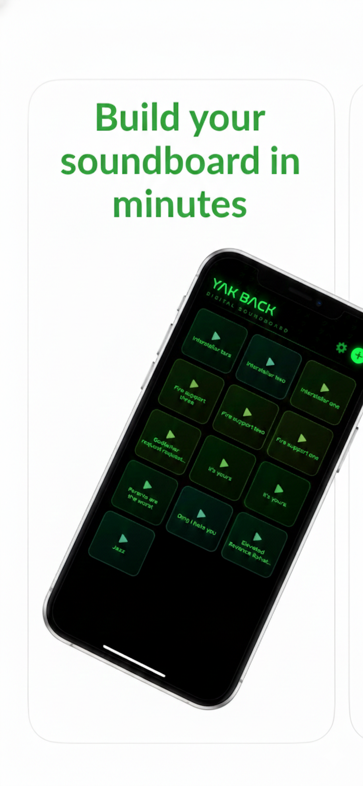
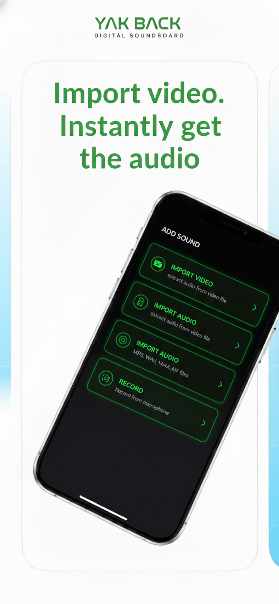
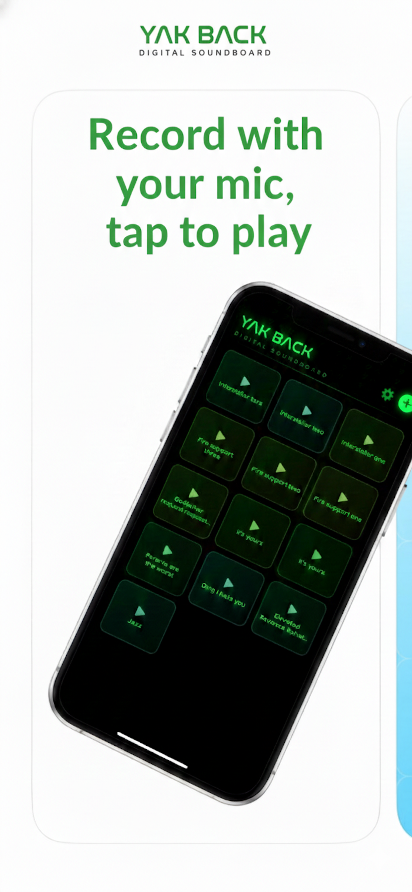
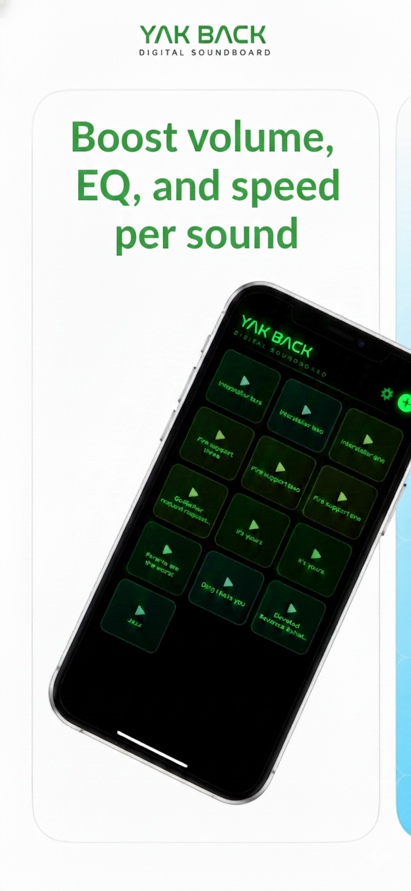

# Yak Back

Yak Back is a customizable iOS digital soundboard. Import video or audio, record clips, trim them, and play multiple pads at once. Pro removes ads and unlocks unlimited sounds.

## Screenshots

## Features
- Import video and extract audio
- Import audio files (MP3, WAV, M4A, AIF)
- Record with the built-in microphone recorder
- Multi-track playback (layer sounds)
- Per-sound controls: volume, boost, speed, EQ, loop count
- Waveform trimming
- Folders, favorites, search, drag-to-reorder
- Save to Files and share
- Siri Shortcuts to play sounds by name
- Optional haptic feedback
- Pro: unlimited sounds and no ads

## Tech Stack
- SwiftUI
- SwiftData
- StoreKit 2 (subscriptions)
- Google Mobile Ads (native + interstitial)
- App Intents / Siri Shortcuts

## Requirements
- Xcode 15+
- iOS 17+

## Setup
1. Open `Yak Back/Yak Back.xcodeproj`
2. Set your Team and Bundle ID
3. Run on device or simulator

## Ads
Free users see a native ad at the bottom of screens and periodic interstitials. Pro subscribers see no ads.

## Subscription
Pro is an auto-renewable subscription configured in App Store Connect:
- Product ID: `com.jimwas.yakback.pro`

## Privacy
Microphone access is required for recording. See the in-app privacy policy.

## License
All rights reserved.
